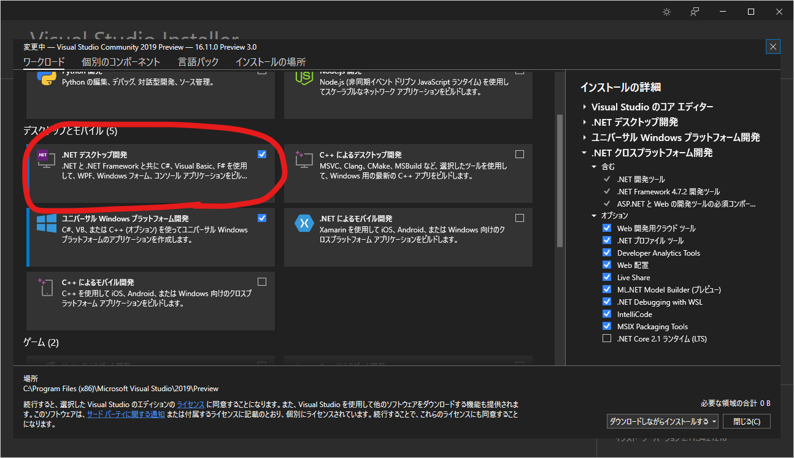
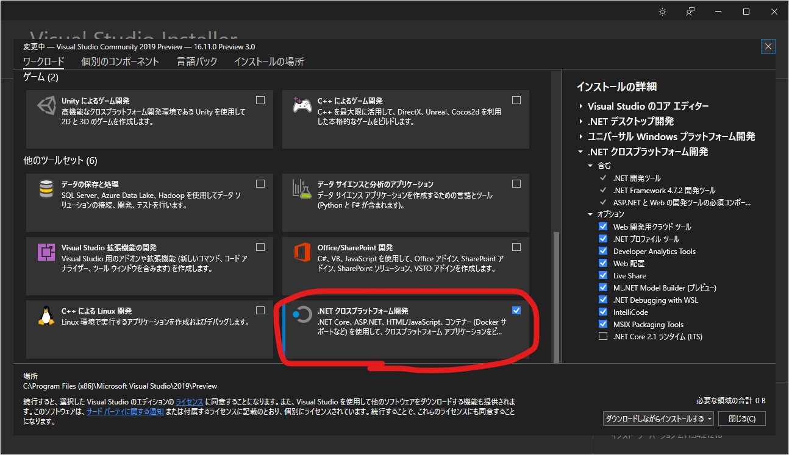
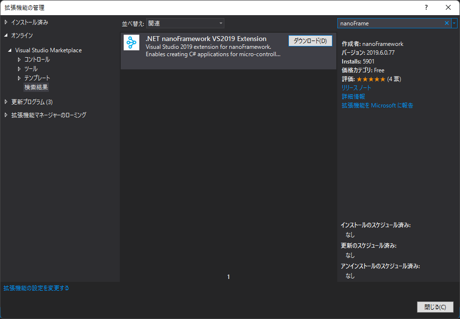
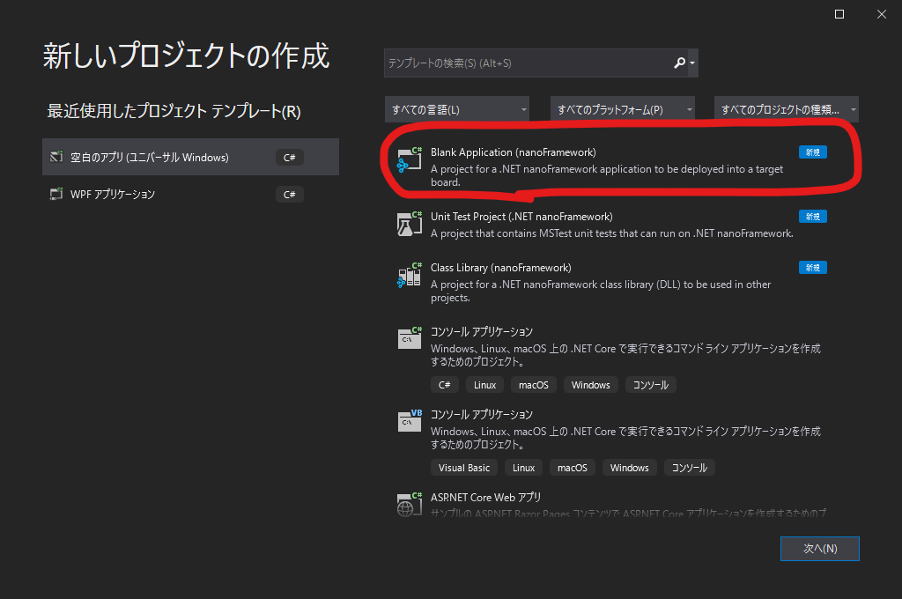
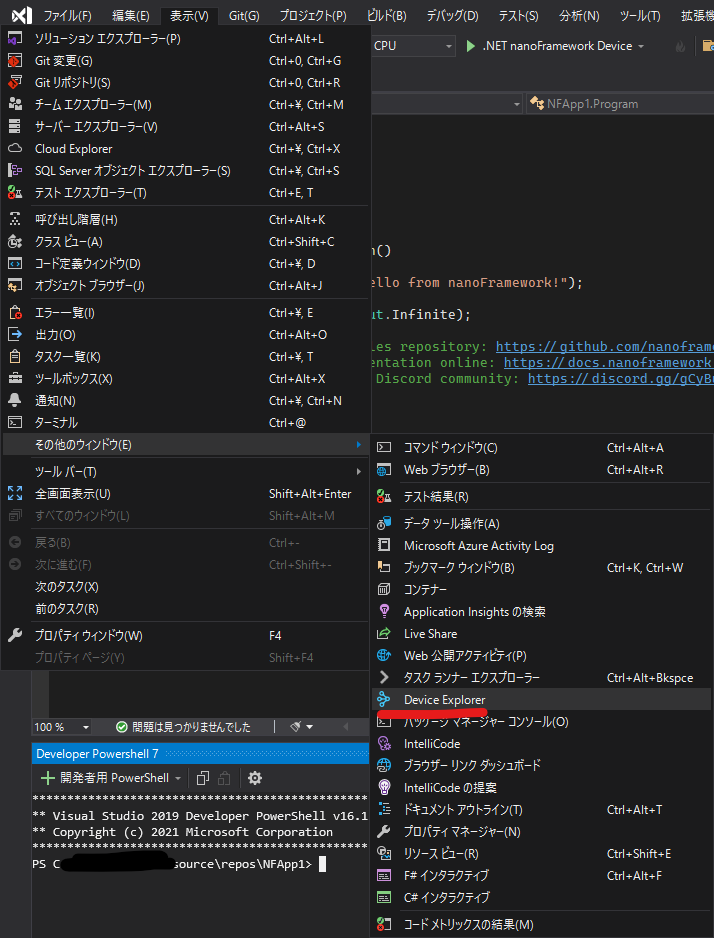

# Getting Started (環境構築)
.net nanoFrameworkの[Getting Started Guide](https://docs.nanoframework.net/content/getting-started-guides/getting-started-managed.html)を参考に、大まかな手順を示します。

以下、

- Windows 11 Pro ver.21H2 (Version 10.0.22000.132)
- Visual Studio 2019 Preview (Version 16.11.0 Preview 3.0)
- .NET 5 (5.0.400-preview.21328.4)

にて検証しています。

(最終更新：2021年8月15日)

## 1. Visual Studio 2019をインストールする
- Visual Studio 2019をインストールします。
- 以下のワークロードが必要になります。
  - .NET デスクトップ開発

  - .NET クロスプラットフォーム開発

  - このとき、「.NET 5 Runtime または SDK」を同時にインストールします。

## 2. 拡張機能「nanoFramework extension for Visual Studio」をインストールする
- Visual Studioを「コード無しで実行」で開き、上部メニューバーから「拡張機能(X) > 拡張機能の管理(M)」と進み拡張機能の管理ウィンドウを表示させます。
- nanoFrameworkと検索し、ヒットしたものをインストールします。Visual Studioを閉じるとVSIX Installerが開くので、指示に従って進めます。


## 3. 使用するボードにファームウェアを書き込むためのツールをインストールする。
- ファームウェアの書き込みには、「nano Firmware Flasher (nanoff)」と呼ばれる .NET Core CLI Command Toolを使用します。
- Visual Studio上のメニューバー「表示(V) > ターミナル」または「Ctrl + @」により、ターミナルを起動します。ここでは「開発者用 Powershell 7」とします。
- 以下のコマンドにより、nanoffをインストールします。
  ```powershell
  PS C:\~~~\repos > dotnet tool install -g nanoff
  :
  : メッセージが流れる...
  :
  次のコマンドを使用してツールを呼び出せます。nanoff
  ツール 'nanoff' (バージョン '1.22.9') が正常にインストールされました。
  ```
- nanoffをインストールした後、新規プロジェクトを作成します。

## 4. プロジェクトを作成し、テンプレートを実行する。
- プロジェクトテンプレートから「Blank Application (nanoFramework)」を探し、プロジェクトを新規作成します。


- エディタ画面が表示されたら、メニューバー「表示(V) > その他のウィンドウ(E) > Device Explorer」を選択します。Device Explorer ツールウィンドウが表示されるはずです。


- 使用するボードをPCに接続し、デバイスマネージャーなどでポート番号を調べます。ESP32-WROOM-32の場合、UARTブリッジドライバが必要になりますので、事前にインストールしておきましょう。
- ESP32-WROOM-32の場合は、以下のコマンドによってファームウェアを書き込めます。(xxには何かの数字が入ります)
  ```powershell
  nanoff --target ESP32_WROOM_32 --serialport COMxx --update
  ```
- 正常に書き込めると、Device Explorerにボード名が表示されます。下記のどれかが表示されているはずです。
  - ESP32_WROOM_32
  - ESP32_WROOM_32_BLE
  - ESP32_WROOM_32_V3_BLE
- 「F5」または「デバッグして実行」などで、テンプレートを実行します。デバッグ出力に「Hello from nanoFramework!」と表示されれば、正常に書き込みできています。
